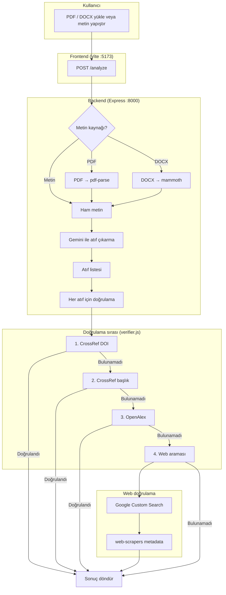

# TÜBİTAK Atıf Doğrulayıcı

Akademik metinlerden (PDF/DOCX) atıfları çıkarıp CrossRef, OpenAlex ve web aramasıyla doğrulayan bir araç. Atıf çıkarma tarafında Google Gemini, web doğrulama tarafında Google Custom Search API var.

## Gereksinimler

- Node.js 18+
- Google API anahtarları (aşağıda anlatılıyor)

## Kurulum

### 1. Bağımlılıkları yükle

```bash
cd backend-js
npm install

cd ../frontend
npm install
```

### 2. Ortam değişkenlerini ayarla

`backend-js` dizininde `.env` dosyası oluştur:

```
GOOGLE_GEMINI_API_KEY=gemini_api_anahtarın
GOOGLE_CSE_API_KEY=cse_api_anahtarın
GOOGLE_CSE_CX=arama_motoru_id
PORT=8000

# İsteğe bağlı — frontend farklı bir portta çalışıyorsa
CORS_ORIGIN=http://localhost:5173
```

## Google API anahtarları

### Demo anahtarlar ve kota

Projede varsayılan olarak bulunan API anahtarları geliştiriciye ait ve ücretsiz kademede. Google Custom Search API günde 100 sorguyla sınırlı olduğundan kota hızla doluyor. Kota dolunca API 403 döner ve web tabanlı doğrulama çalışmaz; CrossRef ve OpenAlex doğrulamaları etkilenmez.

Kendi Google hesabınızla ayrı bir proje oluşturursanız kota sizin hesabınıza bağlı olur, bu sorunu yaşamazsınız.

### Gerekli anahtarlar

| Değişken | Açıklama | Zorunlu |
|----------|----------|---------|
| `GOOGLE_GEMINI_API_KEY` | Atıf çıkarma için. [Google AI Studio](https://aistudio.google.com/apikey) üzerinden alınır. | Evet |
| `GOOGLE_CSE_API_KEY` | Web araması için. [Google Cloud Console](https://console.cloud.google.com/) > Custom Search API. | Hayır (CrossRef/OpenAlex yeterli olabilir) |
| `GOOGLE_CSE_CX` | Programlanabilir Arama Motoru ID'si. [programmablesearchengine.google.com](https://programmablesearchengine.google.com/) adresinden oluşturulur. | Hayır |
| `CORS_ORIGIN` | Frontend'in çalıştığı origin. Varsayılan: `http://localhost:5173`. Farklı bir port veya domain kullanıyorsan ayarla. | Hayır |

### Custom Search API kurulumu

1. [Google Cloud Console](https://console.cloud.google.com/) > APIs & Services > Library > Custom Search API'yi etkinleştir.
2. [Programmable Search Engine](https://programmablesearchengine.google.com/) adresinde bir arama motoru oluştur.
3. `GOOGLE_CSE_API_KEY` ve `GOOGLE_CSE_CX` değerlerini `.env` dosyasına ekle.

## Çalıştırma

### Backend (port 8000)

```bash
cd backend-js
npm start
```

Geliştirme modunda:

```bash
cd backend-js
npm run dev
```

### Frontend (Vite)

```bash
cd frontend
npm run dev
```

Tarayıcıda `http://localhost:5173` (veya Vite'ın gösterdiği adres) açılır. Frontend varsayılan olarak `http://127.0.0.1:8000` adresindeki backend'e bağlanır.

## Kullanım

1. PDF veya DOCX dosyası yükleyin (maks. 15 MB), ya da metni doğrudan yapıştırın.
2. "Analiz Et"e tıklayın. Atıflar çıkarılıp sırayla doğrulanır: CrossRef, OpenAlex, Web Araması.

## Sistem akışı



## Port yönetimi

Port 8000 meşgulse, **proje kök dizininde** şu komutları çalıştırın:

```bash
npm run check-port
npm run free-port
```

## Proje yapısı

```
scriptlerle-atif/
├── backend-js/
│   ├── server.js            # Express sunucusu
│   ├── llm-extractor.js     # Gemini ile atıf çıkarma
│   ├── verifier.js          # CrossRef, OpenAlex, Web pipeline
│   ├── openalex-verifier.js # OpenAlex doğrulama
│   ├── web-verifier.js      # Web arama doğrulaması
│   ├── web-scrapers.js      # Siteye özel metadata çekiciler
│   ├── google-search.js     # Google Custom Search API
│   └── .env                 # API anahtarları (oluşturulmalı)
├── frontend/
│   └── src/                 # React arayüzü
├── README.md
└── package.json
```

## Sorun giderme

| Sorun | Çözüm |
|-------|-------|
| 403 Forbidden (Google Search) | Kota dolmuş veya API etkin değil. Kendi hesabınızla proje oluşturun. |
| Gemini API anahtarı gerekli | `GOOGLE_GEMINI_API_KEY`'i `.env` dosyasına ekleyin. |
| Port 8000 meşgul | `npm run free-port` ile portu boşaltın. |
| CORS hatası | Backend varsayılan olarak `http://localhost:5173`'e izin verir. Frontend farklı bir adreste çalışıyorsa `.env` içinde `CORS_ORIGIN` değişkenini ayarlayın. |
